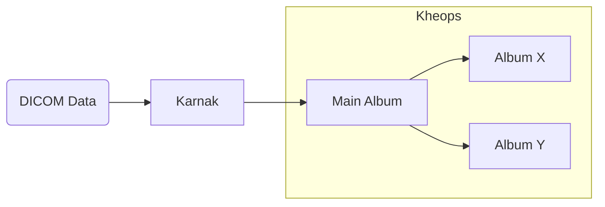

## Create a destination album

To create a Kheops album as a destination, the following values must be set:

* Protocol: STOW
* DICOM endpoint: /api/studies

To create the album destination, please refer to the [official documentation](https://docs.kheops.online/docs/albums/new_album). of Kheops.

Once the album is created, please follow these steps to configure the album as a destination in Karnak.

1. Create a new token

2. Give **WRITE** permission to the token and set the expiration date

3. Copy the authentication token value to be used in the header of your Karnak destination

The creation and configuration of a STOW Destination in Karnak is detailed [here](../gateway/destinations/#stow-destination).

## Switching in different Kheops albums

When a destination points to a Kheops album, the data can be propagated to underlying albums.

This is useful when a cohort of studies is sent to a research group for example, without sharing all the album studies.

Studies cannot be shared between different Kheops instances, one destination must be configured in Karnak per Kheops instance.

The purpose of this functionality is to take advantage of the Kheops API to propagate the data to different places without having to create new destinations in Karnak. At the same time, the data is split according to rules defined in Kheops to prevent data leakage and allow the authorized persons to access only the relevant data and not all the main album.

The following diagram illustrates the behavior of data being processed through Karnak and sent to multiple Kheops albums.

First, a DICOM instance is received by Karnak. After processing it, it sends the instance to the main Kheops album. Depending on existing rules and conditions, the instance will also be shared to the album X and Y.

### Create a switching Kheops album

To share a DICOM instance in different Kheops albums, the following fields must be filled and **validated by clicking on Add button**.

| Fields                       | Description                                                                                          |
|------------------------------|------------------------------------------------------------------------------------------------------|
| Url API                      | The url of the Kheops API                                                                            |
| Valid token of destination   | The token to write to the album destination. Need **WRITE** permission                               |
| Valid token of source        | The token to shared from the album source. Need **READ, SEND** (Sharing in the Kheops UI) permission |

The condition field defines a condition to enable sharing an instance to a specific album if it is evaluated to true.

The conditions syntax and usage is detailed in the [Conditions](../../profiles/conditions) page.
