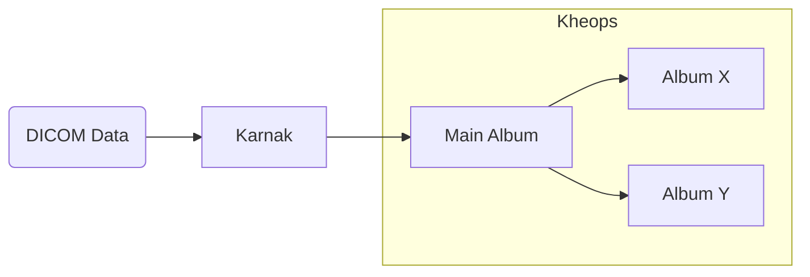

## Create a destination album

To create a Kheops album as a destination, configure the following values:

* **Protocol**: STOW
* **DICOM endpoint**: /api/studies

For detailed instructions on creating an album, refer to the [official Kheops documentation](https://docs.kheops.online/docs/albums/new_album).

Once the album is created, follow these steps to configure it as a destination in Karnak:

##### 1. Create a new token

##### 2. Configure token permissions

Give **WRITE** permission to the token and set the expiration date.

##### 3. Copy the authentication token

Copy the authentication token value to use in the header of your Karnak destination.

For complete instructions on creating and configuring a STOW destination in Karnak, see [Destinations](../gateway/destinations/#stow-destination).

## Switching to different Kheops albums

When a destination points to a Kheops album, data can be propagated to underlying albums within the same Kheops instance.

This feature is useful for sharing specific studies with research groups without exposing the entire album. For example, you can send a cohort of studies to collaborators while maintaining data isolation.

> [!INFO]
> Studies cannot be shared between different Kheops instances. You must configure a separate destination in Karnak for each Kheops instance.

This functionality leverages the Kheops API to distribute data to multiple locations without creating additional destinations in Karnak. Data is automatically split according to rules defined in Kheops, ensuring that authorized users access only relevant data.

The following diagram illustrates how data flows through Karnak and is distributed to multiple Kheops albums:

First, a DICOM instance is received by Karnak. After processing it, it sends the instance to the main Kheops album. Depending on existing rules and conditions, the instance will also be shared to the album X and Y.

### Create a switching Kheops album

To share a DICOM instance in different Kheops albums, the following fields must be filled and **validated by clicking on Add button**.

| Fields                       | Description                                                                                          |
|------------------------------|------------------------------------------------------------------------------------------------------|
| Url API                      | The url of the Kheops API                                                                            |
| Valid token of destination   | The token to write to the album destination. Need **WRITE** permission                               |
| Valid token of source        | The token to shared from the album source. Need **READ, SEND** (Sharing in the Kheops UI) permission |

The condition field defines a condition to enable sharing an instance to a specific album if it is evaluated to true.

The condition syntax and usage are detailed in the [Conditions](../../profiles/conditions) page.
