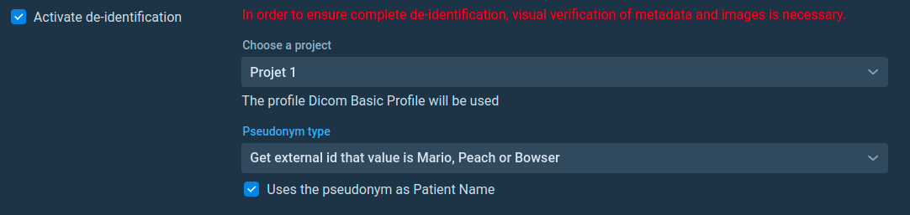

# ExternalID Provider 

WARNING: Surely available in the KARNAK v0.9.6

In Karnak, it is possible to implement external id providers. This feature is interesting if you have your own external id provider (pseudonym). When starting KARNAK, you can inject your implementation which contains the code to query your external id provider.

## Install externalid provider interface package into local repository 

1. Download [karnak](https://github.com/OsiriX-Foundation/karnak-docker) repository.

2. Into the `externalid-provider-interface` directory, execute the following command for use externalid-provider-interface as a dependency in other projects locally: 

   ```bash
   mvn clean install
   ```


## Create your class externalid provider implementation

To create an implementation of your external id provider, you need to create a new maven project.

Prerequisites:

- JDK 14
- Maven 3

1. Add externalid-provider-interface dependency in pom.yml

```xml
<dependency>
  <groupId>org.karnak</groupId>
  <artifactId>externalid-provider-interface</artifactId>
  <version>1.0</version>
</dependency>
```

2. The project must be contained in `org.karnak` package.

3. The classname should be `ExternalIDProviderImpl`.

4. The `ExternalIDProviderImpl` must be implement `ExternalIDProvider` interface like a following line.

   ```java
   public class ExternalIDProviderImpl implements ExternalIDProvider{
   	...
   }
   ```

5. Here is a simple code example of external ID provider provider which should be contained in `org.karnak` package

   ```java
   package org.karnak; // <== package org.karnak
   
   import java.util.Map;
   import org.dcm4che3.data.Attributes;
   import org.dcm4che3.data.Tag;
   
   public class ExternalIDProviderImpl implements ExternalIDProvider{ // <== Classname ExternalIDProviderImpl
     @Override
     public String getExternalID(Attributes attributes) {
       try {
         final String patientSex = attributes.getString(Tag.PatientSex);
         switch (patientSex) {
           case "M":
             return "MARIO";
           case "F":
             return "PEACH";
           default:
             return "BOWSER";
         }
       } catch(Exception e) {
         throw new IllegalStateException("This error will be reported to KARNAK");
       }
     }
   
     @Override
     public String getDescription() {
       return "Get external id that value is Mario, Peach or Bowser";
     }
   
     @Override
     public Map<String, String> getInformation(Attributes attributes) {
       return null;
     }
   }
   ```

They are 3 methods (getExternalID, getDescription and getInformation) :

1. `getExternalID` Is the method that provides the external id (pseudonym) to KARNAK.

2. `getDescription` Is the method that provides the visible text in the user interface for select the corect external id provider type. See the following picture. 

   

3. `getInformation` This methode are not yet used, but will be useful to provide further data to KARNAK in the near future.

## Generate your externalid provider implementation jar

Once you have finished creating your class, you need to create the jar for your project. It is important that the name of your jar is unique for each externalid provider you want to implement. KARNAK uses the jar name to load implementations, so that there is no conflict it is important that this name is unique. To create your jar, just run the following command in your externalid provider implementation project.

```
mvn clean install
```

The generated jar is in the `target` directory.

## Add your implementation jar into KARNAK

In developpement environnement:

1. Create `externalid-providers` directory to KARNAK root directory. 
2. Add the generated jar file to the `externalid-providers` directory.

In docker environnement:

1. In the karnak docker, add the generated jar to the following path `app/externalid-providers`.

## A jar was loaded and the deleted from the folder

If you have already loaded a jar in KARNAK and you delete it from the externalid-provider directory, you will no longer be able to launch KARNAK. In the log, you will get an error like this:

 `ERROR [restartedMain] org.karnak.backend.config.ExternalIDProviderConfig:  File not found in /PATH/externalid-providers/JARNAME.jar` 

To relaunch KARNAK 2 solutions are available: 

1. The first is to delete or modify all the destinations containing this externalid provider. Then, in the KARNAK database, delete in the externalid_provider table the row containing the provider that you no longer use.
2. The second, put the same jar back in the directory.
3. The third, create a jar containing the same file name as the one that was no longer present