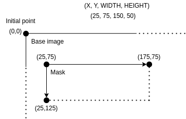

# Image modifications

## Defacing

This profile applies defacing to the image data of the DICOM instance.

This profile can only be applied to images in the **Axial orientation** of the following SOP:

* 1.2.840.10008.5.1.4.1.1.2 - CT Image Storage
* 1.2.840.10008.5.1.4.1.1.2 - Enhanced CT Image Storage

This profile element requires the following parameters:

* `name`: description of the action applied
* `codename`: `clean.recognizable.visual.features`
* `condition`: optional, defines a condition to evaluate if this profile element should be applied to this DICOM instance

## Pixel Data Cleaning

This profile applies a mask defined by the user on the DICOM instance pixel data to remove identifying information burned in the image.

The details on the masks definition can be found below.

This profile is applied only on the following SOP:

* 1.2.840.10008.5.1.4.1.1.6.1 - Ultrasound Image Storage
* 1.2.840.10008.5.1.4.1.1.7.1 - Multiframe Single Bit Secondary Capture Image Storage
* 1.2.840.10008.5.1.4.1.1.7.2 - Multiframe Grayscale Byte Secondary Capture Image Storage
* 1.2.840.10008.5.1.4.1.1.7.3 - Multiframe Grayscale Word Secondary Capture Image Storage
* 1.2.840.10008.5.1.4.1.1.7.4 - Multiframe True Color Secondary Capture Image Storage
* 1.2.840.10008.5.1.4.1.1.3.1 - Ultrasound Multiframe Image Storage
* 1.2.840.10008.5.1.4.1.1.77.1.1 - VL Endoscopic Image Storage

**Or** if the tag value Burned In Annotation (0028,0301) is "YES"

This profile element requires the following parameters:

* `name`: description of the action applied
* `codename`: `clean.pixel.data`
* `condition`: optional, defines a condition to evaluate if this profile element should be applied to this DICOM instance

The `condition` parameter can be used to exclude the images coming from a specific machine for example.

```yaml
profileElements:
  - name: "Clean pixel data"
    codename: "clean.pixel.data"
    condition: "!tagValueContains(#Tag.StationName,'ICT256')"
```

## Masks Definition

The mask definition requires the following parameters:

* `stationName`: source station name that is matched against the attribute Station Name in the DICOM instance. It allows the mask to be specific depending on the station that generated the image. The value can also be set to `*` to match any station. 
* `color`: color of the mask in hexadecimal
* `rectangles`: defines the list of rectangles to apply to mask identifying information

A rectangle is defined by the following required parameters:

* `x`: x coordinate of the upper left corner of the rectangle
* `y`: y coordinate of the upper left corner of the rectangle
* `width`: width of the rectangle
* `height`: height of the rectangle

The upper left corner of the image corresponds to the coordinates (0,0).

The schema below illustrate the definition of a rectangle having the following parameters (25, 75, 150, 50).



The example below shows how to define a default mask (`stationName: *`) and a mask that will be applied only to instances coming from the R2D2 station.

```yaml
masks:
  - stationName: "*"
    color: "ffff00"
    rectangles:
      - "25 75 150 50"
  - stationName: "R2D2"
    color: "00ff00"
    rectangles:
      - "25 25 150 50"
      - "350 15 150 50"
```

## Pixel Data Cleaning Exceptions

In some cases, often based on the manufacturer and equipment, pixel data can contain embedded identifying information. Below is an exhaustive example illustrating how to apply cleaning pixel profile element depending on the station that produced the image, applicable to any DICOM modality.

```yaml
name: "Clean pixel data"
version: "1.0"
minimumKarnakVersion: "0.9.2"
defaultIssuerOfPatientID:
profileElements:
  - name: "Add tag BurnedInAnnotation if does not exist"
    codename: "action.add.tag"
    condition: "tagValueContains(#Tag.StationName, 'ICT256') && !tagIsPresent(#Tag.BurnedInAnnotation)"
    arguments:
      value: "YES"
      vr: "CS"
    tags:
      - "(0028,0301)"

  - name: "Set BurnedInAnnotation to YES"
    codename: "expression.on.tags"
    condition: "tagValueContains(#Tag.StationName, 'ICT256')"
    arguments:
      expr: "Replace('YES')"
    tags:
      - "(0028,0301)"

  - name: "Clean pixel data"
    codename: "clean.pixel.data"

  - name: "DICOM basic profile"
    codename: "basic.dicom.profile"

masks:
  - stationName: "*"
    color: "ffff00"
    rectangles:
      - "25 75 150 50"
  - stationName: "ICT256"
    color: "00ff00"
    rectangles:
      - "25 25 150 50"
      - "350 15 150 50"
```
