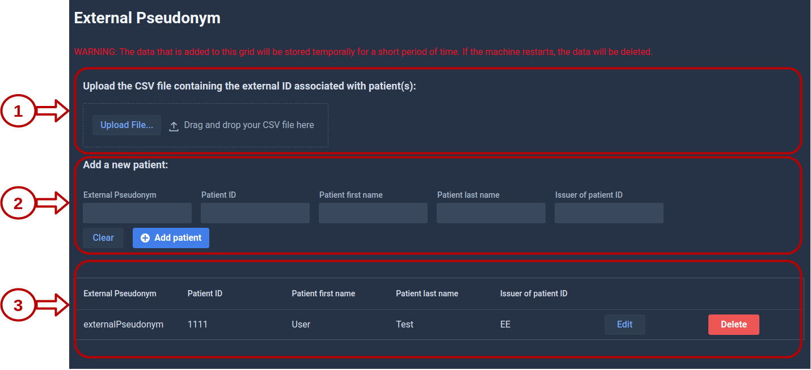
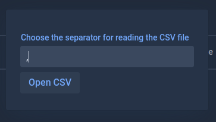
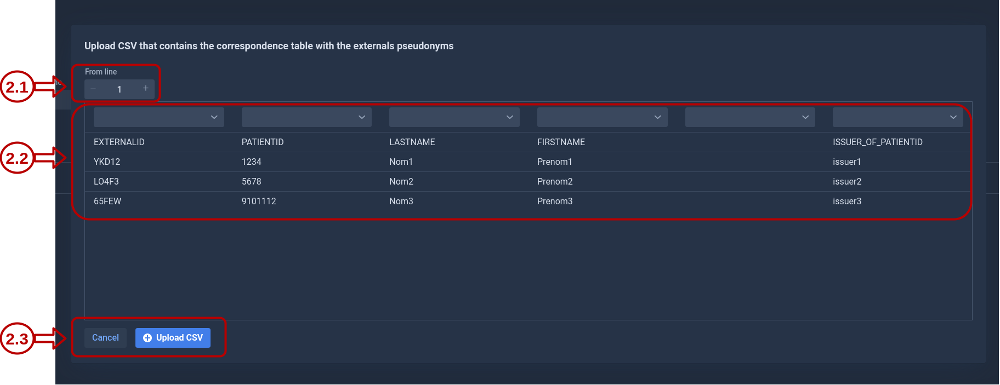
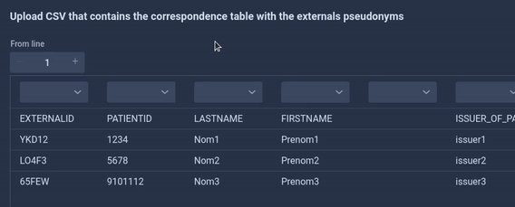

# External pseudonym

KARNAK will always use a given pseudonym when de-identifying. In this page, it is possible to import your data manually or from a CSV file your existing pseudonyms. So that KARNAK can de-identify your studies while using your pseudonyms.

The pseudonyms are stored for a short period of time. Your data is stored in the cache for maximum 7 days. If KARNAK is restarted, the uploaded data will be lost.

### 1. Upload a CSV file

To upload a CSV file containing external pseudonyms, you must click in the "Upload File" button. 

A pop-up will appear and offer to enter the separator character of the CSV file. In the exemple bellow, we use the "," separator. 

After click "Open CSV" button, a grid will be appear with the CSV file content.  

### 1.1 From line

This input field allows you to indicate from which line you want to start reading the CSV file. Your CSV file may contain headers. If these headers are in line 1 like the above example (EXTERNALID, PATIENTID, LASTNAME, FIRSTNAME, ISSUER_OF_PATIENTID), you can specify the entry "From line" to the value 2. 

### 1.2 Select 

All the fields are mandatory, excepted the Issuer of patient ID.

### 1.3 Grid

### 1.4 Upload CSV

### 2. Add a new patient

All the fields are mandatory, excepted the Issuer of patient ID.

### 3. Pseudonym kept temporarily

