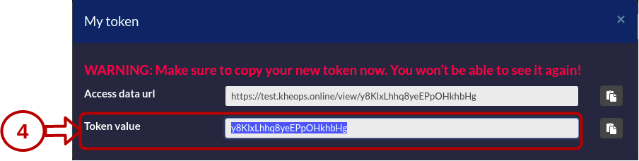

# KHEOPS

## Create a destination album

To create a KHEOPS album as a destination you must use:

* Protocol: STOW
* DICOM endpoint: /api/studies

First create the album destination, please refer to the official documentation of KHEOPS to [create a new album](https://docs.kheops.online/docs/albums/new_album).




1 Create a new token

2 Give **WRITE** permission to the token

3 Set a token expiration date

4 Copy the token value to be used in the header of your KARNAK destination

Below is an example of creating headers with the token value:

```
<key>Authorization</key>
<value>Bearer y8KlxLhhq8yeEPpOHkhbHg</value>
```

## Switching in different KHEOPS albums

When you create a destination that points to a KHEOPS album, you can propagate your data to underlying albums.

This is useful when you want to send a cohort of studies to a research group for example, without sharing all of the album studies.

**Beware**, the study sharing between album, must be done only within the same KHEOPS. Studies cannot be shared between different KHEOPS instances, you should create one destination per KHEOPS instance.

The purpose of this functionality is to allow sending your data to a single destination and to use the KHEOPS API to propagate your data to different places without having to create a new destination.

The following illustration show a scenario of this functionality. The illustrated scenario allows you to send a DICOM data to KARNAK. KARNAK has a destination defined to send the data to a KHEOPS album (Album main). This means that this album will regroup all the data sent by KANRAK. To prevent researchers or end users from having access to all the data, the data will be shared in other albums according to defined conditions.

1. The DICOM data is send to KARNAK
2. KARNAK send the data to the album main in KHEOPS
3. The data will be shared in the album X and in the album Y


### Create a switching KHEOPS album

To share your DICOM in different KHEOPS album, you must complete the following fields and **validate them by clicking on Add button**.

The destination is the album where the studies will be shared.

The source is the album main, where all studies are sent.


| Fields                     | Description                                                  |
| -------------------------- | ------------------------------------------------------------ |
| Url API                    | The url of the KHEOPS API                                    |
| Valid token of destination | The token to write to the album destination. Need **WRITE** permission |
| Valid token of source      | The token to shared from the album source. Need **READ, SEND** (Sharing in the KHEOPS UI) permission |

The condition field will allow you to assign a condition to enable sharing to the destination.

A condition is an expression to apply to a given tag. An expression is a programming language that allows you to return a value or an object according to a certain condition. In this case, the value returned is always a Boolean (True/False).

You can use some constants defined in an expression.

- `#Tag` is a constant that permit to access to the all tag integer value in the DICOM standard. Example, `#Tag.StudyDescription` allow to access to the integer value of tag (0008,1030).
- `#VR` is a constant that permit to access tho the all VR value in the DICOM standard. Example, `#VR.LO` is the Long String type.

The list of functions available to create your conditions are listed below. **Beware** all these functions are case sensitive.

---

`tagValueIsPresent(int tag, String value)` or `tagValueIsPresent(String tag, String value)`

This function will retrieve the `tag` value of the DICOM and compare it with the `value` given.

The following example will checks if the study description is "755523-st222-GE".

```
tagValueIsPresent(#Tag.StudyDescription, "755523-st222-GE")
tagValueIsPresent("0008,1030", "755523-st222-GE")
```

---

`tagValueContains(int tag, String value)` or `tagValueContains(String tag, String value)`

This function will retrieve the `tag` value of the DICOM and checks if the `value` given appear in the tag value.

The following example will checks if the study description contains "st222".

```
tagValueContains(#Tag.StudyDescription, "st222")
tagValueContains("0008,1030", "st222")
```

---

`tagValueBeginsWith(int tag, String value)` or `tagValueBeginsWith(String tag, String value)`

This function will retrieve the `tag`value of the DICOM and checks if the `tag` value begins with the `value`

The following example will checks if the study description begins with "755523".

```
tagValueBeginsWith(#Tag.StudyDescription, "755523")
tagValueBeginsWith("0008,1030", "755523")
```

---

`tagValueEndsWith(int tag, String value)` or `tagValueEndsWith(String tag, String value)`

This function will retrieve the `tag`value of the DICOM and checks if the `tag` value ends with the `value`

The following example will checks if the study description ends with "GE".

```
tagValueEndsWith(#Tag.StudyDescription, "GE")
tagValueEndsWith("0008,1030", "GE")
```

---

