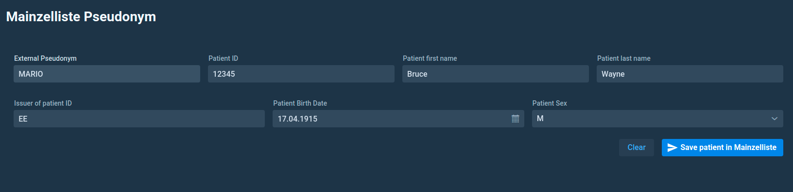

# Mainzelliste pseudonym

KARNAK always uses a given pseudonym when de-identifying. In this page, it is possible to add pseudonym manually and store it in the mainzellist configured in KARNAK.

The Mainzelliste config used in KARNAK is defined in this link: [Mainzelliste config](https://github.com/OsiriX-Foundation/karnak-mainzelliste/blob/extid/mainzelliste.conf)

The image bellow illustrated the view containing the Mainzelliste field. All field are mandatory excepted:

1. Patient first name
2. Issuer of patient ID

