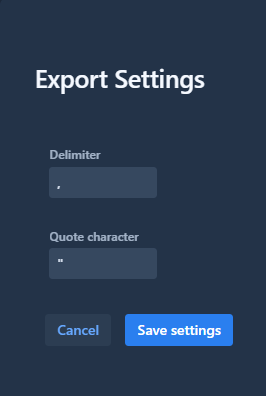

# Monitoring

Monitoring view is used to follow transfers in progress or recent transfers.

Currently limited to 150000 transfers, it is possible to browse the different pages via the navigation bar at the bottom center of the view

An automatic cleaning occurs on the monitoring tables, if the limit is exceeded.

The view display the most recent transfers and is ordered with most recent first.

Filters allow to limit the results and makes it easier to find a transfer.

It is possible to export the list of transfers via the export functionality in csv format depending on the filters selected.

By clicking on a transfer, it opens details of the information original and deidentified.

* [Filters](#1-filters)
* [Browsing](#2-browsing)
* [Refresh](#3-refresh)
* [Export](#4-export)

### 1. Filters

Filters allow to ease the search of transfers.
It is possible to filter by:
* Date/Time of transfers
* Study UID (original or deidentified) 
* Serie UID (original or deidentified)
* Sop Instance UID (original or deidentified)
* Status of the transfer (not sent, sent, all) 

### 2. Browsing

It is possible to go throw the different pages of the list of transfers by using the navigation bar.

### 3. Refresh

By clicking on the refresh button, the list of transfers is updated with last transfers.

### 4. Export

Export settings allow to customize the csv before exporting it. It is possible to change the csv delimiter and the quote character of the file.

Once customize, the export is launched by clicking on the export button.

Export will use the filters selected in the monitoring view and export only transfers corresponding to the filters. 