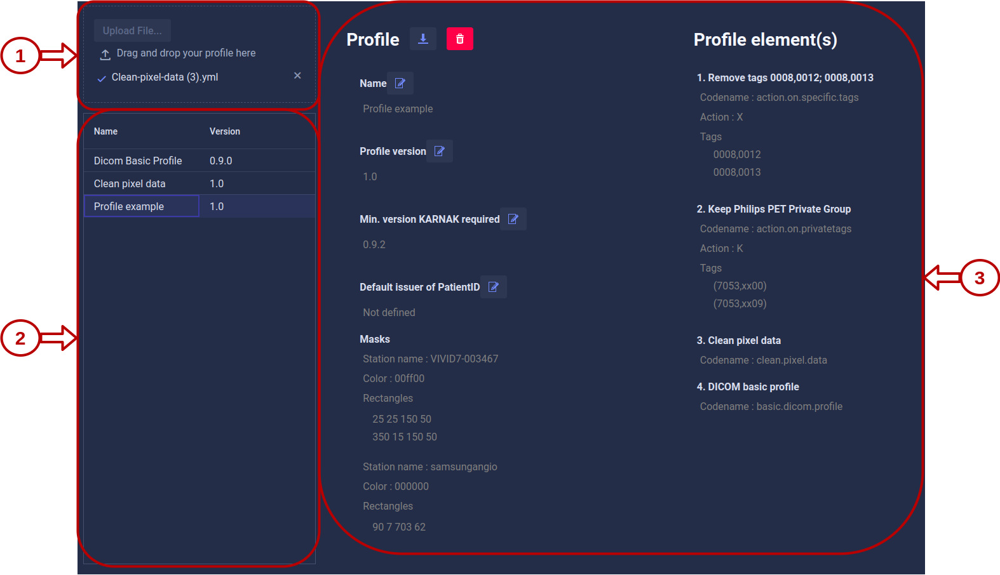
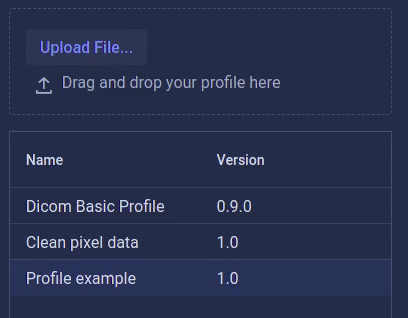

# Profiles

The profile page allows you to manage your profiles. On this page, you can perform the following actions:

* [Upload a profile](#1-profile-drag-and-drop-area)
* [View the profiles available](#2-profile-list)
* [View profile details](#3-profile-details)
* [Download a profile](#3-profile-details)
* [Remove a profile](#3-profile-details)
* [Edit a profile](#3-profile-details)

KARNAK has the "Dicom Basic Profile" profile by default, the details about this profile is explained in the section [How KARNAK does ?](../profiles/rules). This profile cannot be deleted or edited, except for the value of default issuer of patient ID. 

### 1. Profile drag and drop area

As presented below, you can drag and drop your yaml profile configuration.

### 2. Profile list

All the profiles available in your KARNAK instance are listed here. To view [Profile details](#profile-details), you can click on a profile.

### 3. Profile details

This panel will change depending on your action.

Once you have clicked on a profile, this panel will display the details about the chosen profile.

If you have drag and drop your profile, the details about the profile uploaded will be presented. In case your profile contains any errors, it will show where and what the error are, as the illustration below.

The following table shows you the different action of icons present in the profile details.

| Icons                                               | Action associated to the icon                                |
| --------------------------------------------------- | ------------------------------------------------------------ |
|  | Download the profile                                         |
|    | Remove the profile. However, if a profile is used by a project, you will not be able to delete it |
|      | Edit the name, version, minimum version KARNAK required and default issuer of patient ID profile. |