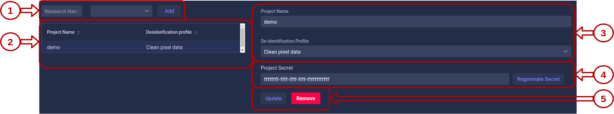

# Projects

When you want to use KARNAK's de-identification methods, you need to associate a project with your destination. This project defines the profile to be used as weel as the integrity of the data using a secret. The secret makes it possible to maintain consistency between the data to be de-identified, see [Action U, Generate a new UID](../deidentification/rules#action-u-generate-a-new-uid) for more details.

The project page allows you to manage your projects. On this page, you can perform the following actions:

* [Create a new project](#1-create-a-project)
* [View the projects created](#2-project-list)
* [Edit a project](#3-project-metadata)
* [Edit project secret](#4-project-secret)
* [Remove a project](#5-action-buttons)

### 1. Create a project

To create a new project, you must give a project name and choose a profile that will be used for de-identification. To validate your choose, you can click on the button "Add". 

The list of profiles that you can associated with a project are the profiles that you have uploaded, see [Profile drag and drop area](profiles#1-profile-drag-and-drop-area).

### 2. Project list

All the projects available in your KARNAK instance are listed here. You can click on a project to view its details in the right panel.

### 3. Project metadata

You can change the project name and the de-identification profile using these inputs. By clicking on the "Update" button, see [Action buttons](#5-action-buttons),  you save your changes.

### 4. Project secret

The secret is generated automatically at the creation of a project. You can generate a new secret by using the "Regenerate Secret" button or by adding your own in the input.

To add your own secret you must respect the following format:

* A secret is a hexadecimal value

* Must contains 32 characters

### 5. Action buttons

| Button                                          | Action                                                       |
| ----------------------------------------------- | ------------------------------------------------------------ |
|  | Save your changes apply to project inputs                    |
|  | Remove the project. However, if a project is used by a destination, you will not be able to delete it |