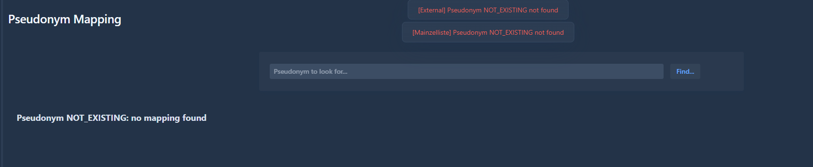

# Pseudonym mapping

The pseudonym mapping is used to retrieve the mapping of pseudonyms added in the views External pseudonym and Mainzelliste pseudonym. 

In order to retrieve the mapping enter the desired pseudonym and click on the Find button.

If found, the external or mainzelliste pseudonym mapping will be displayed.

Otherwise some messages will indicate no mapping found.

